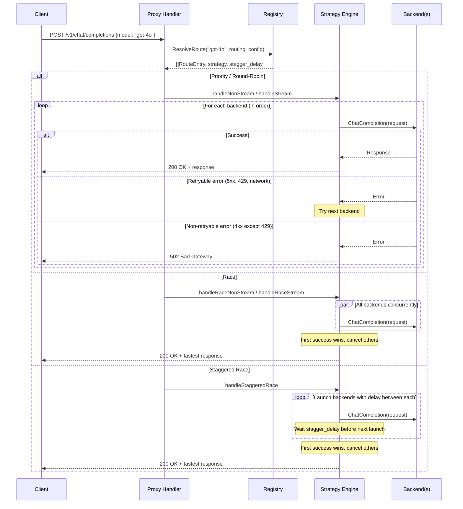
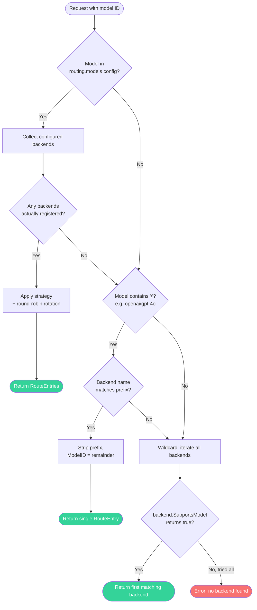
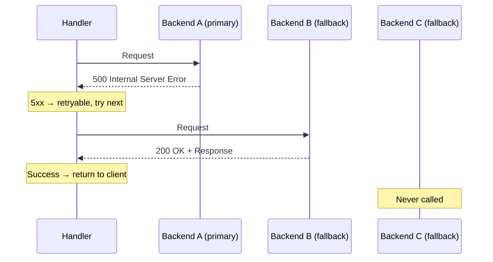
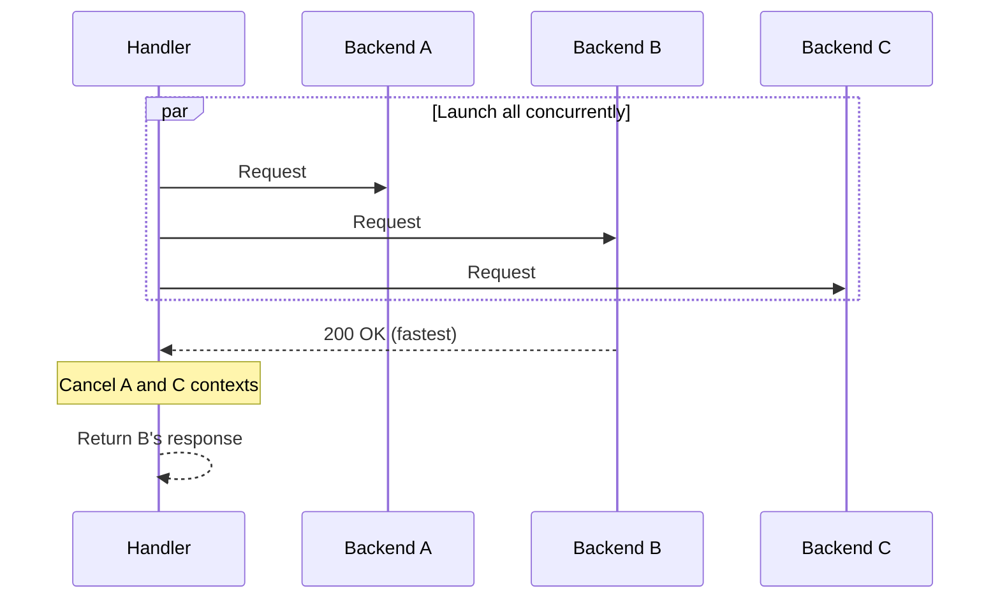
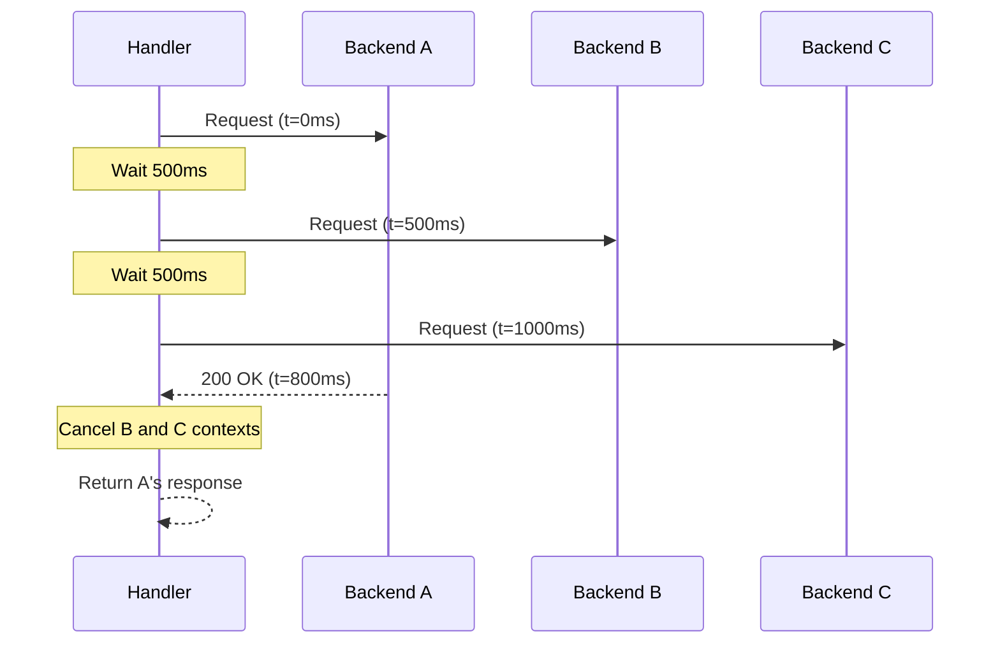
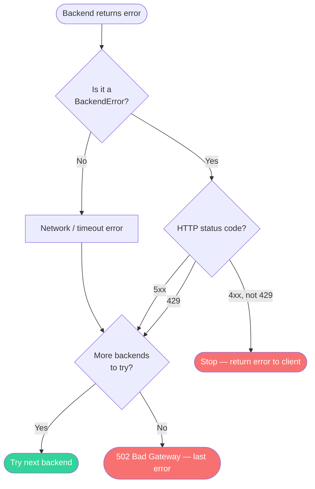
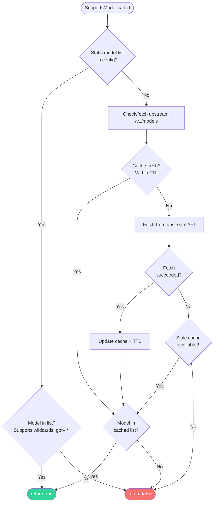
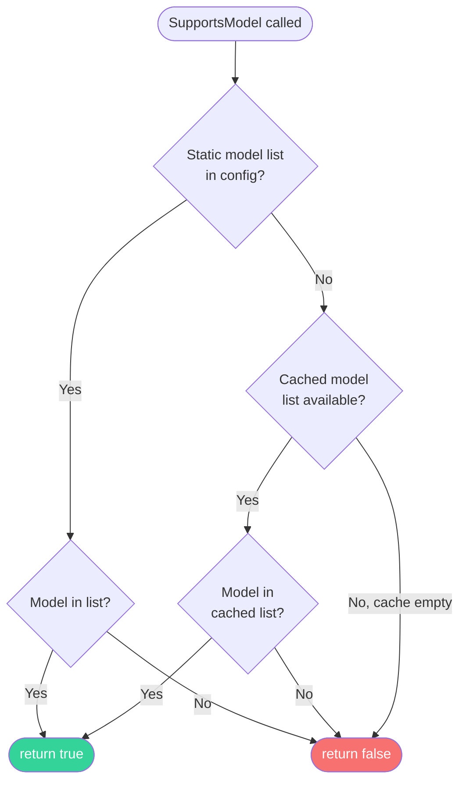
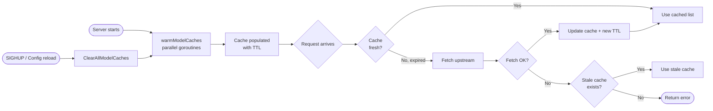

# Routing

This document explains how LLM API Proxy routes incoming requests to the correct backend(s), which strategies are available, how failover works, and how model caching interacts with routing decisions.

## Overview

Every chat completion request includes a `model` field. The proxy uses this field to determine which backend(s) should handle the request. The routing system has three resolution layers, tried in order:

1. **Explicit routing config** — exact model match in `routing.models[]`
2. **Prefix routing** — `backend/model` format (e.g., `openrouter/gpt-4o`)
3. **Wildcard matching** — first backend whose `SupportsModel()` returns true

Once backends are selected, a **routing strategy** determines how they are invoked (sequentially, in parallel, etc.).

## Request Lifecycle



## Route Resolution

The `ResolveRoute()` method is the core of the routing system. It takes a model ID and the routing configuration, and returns a list of backends to try.



### Resolution Steps in Detail

#### 1. Explicit Config Match

The highest-priority resolution. If the requested model exactly matches an entry in `routing.models[]`, the configured backends are used:

```yaml
routing:
  strategy: priority # Global default
  stagger_delay_ms: 500 # Default for staggered-race

  models:
    - model: "gpt-4o"
      backends: ["openai", "openrouter"] # Try openai first, then openrouter
      strategy: "priority" # Per-model override (optional)

    - model: "claude-sonnet-4"
      backends: ["anthropic", "openrouter"]
      strategy: "race" # Both in parallel
```

**Strategy resolution order:**

1. Per-model `strategy` field (if set)
2. Global `routing.strategy` field (if set)
3. Default: `"priority"`

**Stagger delay resolution:**

1. Per-model `stagger_delay_ms` (if > 0)
2. Global `routing.stagger_delay_ms` (if > 0)
3. Default: 500ms

**Round-robin behavior:** If the resolved strategy is `round-robin`, the `RoundRobinTracker` rotates the entry list so a different backend leads on each request. All others remain in order for fallback.

**Unregistered backends:** If a backend name in the config doesn't match any registered backend (e.g., it was removed or disabled), it is silently skipped.

#### 2. Prefix Routing

If no explicit config match is found, the proxy checks whether the model ID contains a `/` separator:

| Request Model               | Backend      | ModelID Forwarded |
| --------------------------- | ------------ | ----------------- |
| `openrouter/gpt-4o`         | `openrouter` | `gpt-4o`          |
| `anthropic/claude-sonnet-4` | `anthropic`  | `claude-sonnet-4` |
| `zai/glm-4-plus`            | `zai`        | `glm-4-plus`      |

The backend name is everything before the first `/`. The model ID forwarded to the backend is everything after.

**Note:** This does NOT check `SupportsModel()`. If the user explicitly targets a backend using prefix notation, the request is forwarded regardless. The backend may return an error if it doesn't support that model.

#### 3. Wildcard Matching

Last resort. The proxy iterates over all registered backends and calls `SupportsModel(modelID)` on each. The first backend that returns `true` is selected.

**Important caveats:**

- Go map iteration order is non-deterministic. If multiple backends support the same model, which one is chosen is undefined.
- For deterministic behavior with overlapping models, always use explicit routing config.
- If no backend supports the model, the proxy returns an error: `"no backend found for model <modelID>"`.

## Routing Strategies

| Strategy             | Behavior                                                                                   | Best For                                   |
| -------------------- | ------------------------------------------------------------------------------------------ | ------------------------------------------ |
| **`priority`**       | Try backends sequentially in list order. First success wins. Fallback on retryable errors. | Preferred provider with fallback chain     |
| **`round-robin`**    | Rotate which backend leads on each request. Others remain in order for fallback.           | Load balancing across equivalent providers |
| **`race`**           | Launch ALL backends concurrently. First success wins, others are cancelled.                | Lowest latency when cost is acceptable     |
| **`staggered-race`** | Launch backends with a configurable delay between each. First success wins.                | Balance between latency and cost           |

### Priority (Default)



### Round-Robin

Works identically to priority for a single request, but the **starting backend rotates** across requests:

| Request # | Backend Order | Notes             |
| --------- | ------------- | ----------------- |
| 1         | A → B → C     | A leads           |
| 2         | B → C → A     | B leads (rotated) |
| 3         | C → A → B     | C leads (rotated) |
| 4         | A → B → C     | Back to A         |

If the leading backend fails, fallback continues through the remaining backends in their rotated order.

The rotation uses per-model atomic counters, so concurrent requests each get a distinct slot without locks.

### Race



All backends are launched as goroutines simultaneously. The first successful response is returned; all other in-flight requests are cancelled via context cancellation.

If ALL backends fail, the last error is returned as a 502.

### Staggered Race

Like race, but backends are launched with a delay between each start:



The delay is configurable per-model or globally (default: 500ms). This reduces cost compared to full race while still providing low latency if the primary backend is fast.

## Error Handling & Fallback Rules

When a backend returns an error during **priority** or **round-robin** execution, the decision to retry the next backend depends on the error type:

| Error Type    | HTTP Status   | Action         | Rationale                               |
| ------------- | ------------- | -------------- | --------------------------------------- |
| Server error  | 5xx           | **Retry next** | Backend is broken, try another          |
| Rate limit    | 429           | **Retry next** | This backend is throttled, try another  |
| Network error | (none)        | **Retry next** | Backend unreachable, try another        |
| Client error  | 4xx (not 429) | **Stop**       | Request is invalid; retrying won't help |



### Special Cases

**Copilot/Codex 401 Unauthorized:** These OAuth-authenticated backends have built-in retry logic. On a 401:

1. The current token is invalidated
2. A fresh token is obtained (via OAuth refresh)
3. The request is retried once with the new token
4. If it fails again, the error propagates normally

This happens transparently inside the backend, before the handler's failover logic sees the error.

## Model Discovery & `SupportsModel()`

Each backend type implements `SupportsModel()` differently, which directly affects wildcard routing:

### OpenAI / Anthropic Backends



**Key behaviors:**

- **Static list configured:** Only models in the list are accepted. Wildcards are supported (e.g., `gpt-4/*` matches `gpt-4/turbo`).
- **No static list:** Models are fetched from the upstream `/v1/models` endpoint and cached with a configurable TTL (default: 5 minutes).
- **Stale-while-error:** If the upstream fetch fails but a cached list exists, the stale cache is used. This prevents routing failures during temporary upstream outages.

### Codex / Copilot Backends



**Key differences from OpenAI/Anthropic:**

- **No inline fetch:** `SupportsModel()` does not trigger an upstream fetch. It only checks existing cache.
- **Cache is warmed at startup:** `warmModelCaches()` runs in parallel goroutines when the registry loads, with a 15-second timeout per backend.
- **Cold cache = false:** If the cache hasn't been populated yet (backend not authenticated, startup still in progress), `SupportsModel()` returns `false`. This prevents routing requests to backends that aren't ready.
- **Authentication required:** These backends use OAuth tokens. If no token is available, `ListModels()` fails and the cache stays empty.

### Cache Lifecycle



**TTL configuration:**

```yaml
server:
  model_cache_ttl: 5m # Default: 5 minutes. Set to 0 to disable caching.
```

## Configuration Examples

### Basic Priority Failover

Two OpenAI-compatible backends; try the primary first, fall back on errors:

```yaml
backends:
  - name: openai
    type: openai
    base_url: https://api.openai.com/v1
    api_key: sk-...

  - name: openrouter
    type: openai
    base_url: https://openrouter.ai/api/v1
    api_key: sk-or-...

routing:
  strategy: priority
  models:
    - model: "gpt-4o"
      backends: ["openai", "openrouter"]
```

### Round-Robin Load Balancing

Distribute requests evenly across two equivalent providers:

```yaml
routing:
  strategy: round-robin
  models:
    - model: "gpt-4o"
      backends: ["openai-1", "openai-2"]
```

### Race for Lowest Latency

Launch requests to both providers simultaneously; use whichever responds first:

```yaml
routing:
  models:
    - model: "claude-sonnet-4"
      backends: ["anthropic", "openrouter"]
      strategy: race
```

### Per-Model Strategy Overrides

Different strategies for different models:

```yaml
routing:
  strategy: priority # Global default

  models:
    - model: "gpt-4o"
      backends: ["openai", "openrouter"]
      strategy: priority # Explicit priority chain

    - model: "claude-sonnet-4"
      backends: ["anthropic", "openrouter"]
      strategy: race # Both in parallel

    - model: "gpt-4o-mini"
      backends: ["openai-1", "openai-2", "openrouter"]
      strategy: round-robin # Load balance
```

### Staggered Race with Custom Delay

Start the primary backend immediately; if it hasn't responded in 300ms, also start the fallback:

```yaml
routing:
  models:
    - model: "gpt-4o"
      backends: ["openai", "openrouter"]
      strategy: staggered-race
      stagger_delay_ms: 300
```

### Mixed Backend Types

Combine different backend types with explicit routing:

```yaml
backends:
  - name: openai
    type: openai
    base_url: https://api.openai.com/v1
    api_key: sk-...

  - name: anthropic
    type: anthropic
    base_url: https://api.anthropic.com
    api_key: sk-ant-...

  - name: copilot
    type: copilot
    base_url: https://api.githubcopilot.com

  - name: codex
    type: codex
    base_url: https://chatgpt.com/backend-api/codex

routing:
  strategy: priority
  models:
    - model: "gpt-4o"
      backends: ["openai", "copilot"] # OpenAI primary, Copilot fallback
    - model: "claude-sonnet-4"
      backends: ["anthropic"] # Only Anthropic
    - model: "o4-mini"
      backends: ["codex", "openai"] # Codex primary, OpenAI fallback
```

### Without Explicit Routing (Wildcard)

If no `routing.models` entry matches, the proxy falls back to wildcard matching. Each backend is queried via `SupportsModel()` and the first match is used:

```yaml
backends:
  - name: openai
    type: openai
    base_url: https://api.openai.com/v1
    api_key: sk-...

  - name: anthropic
    type: anthropic
    base_url: https://api.anthropic.com
    api_key: sk-ant-...

# No routing config — wildcard matching is used.
# "gpt-4o" → routed to openai (if its model list includes gpt-4o)
# "claude-sonnet-4" → routed to anthropic (if its model list includes claude-sonnet-4)
```

**Warning:** Wildcard matching uses Go map iteration order, which is non-deterministic. For production setups with overlapping models, always configure explicit routing.

### Prefix Routing (User-Directed)

Users can bypass all routing config by prefixing the model with a backend name:

```
POST /v1/chat/completions
{
  "model": "openrouter/gpt-4o",
  ...
}
```

This always routes to the `openrouter` backend with model ID `gpt-4o`, regardless of routing config.
